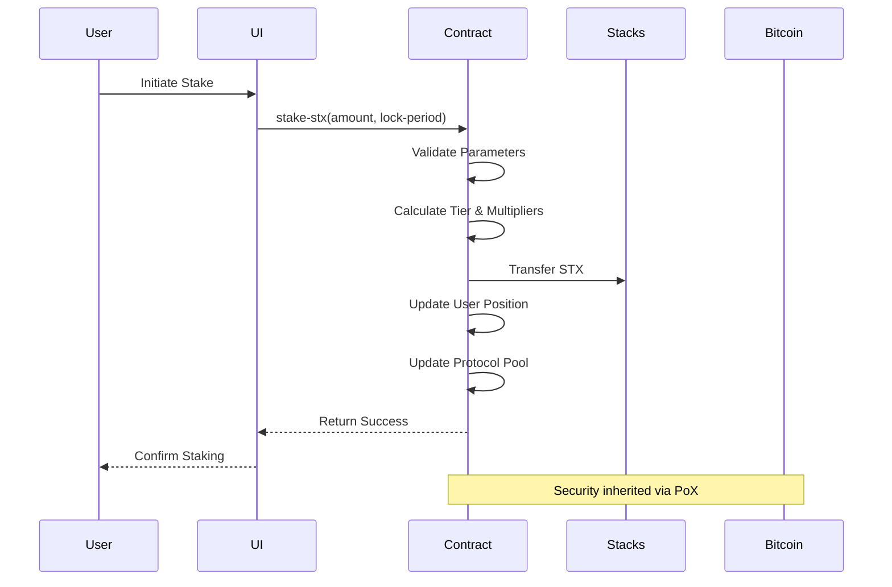

# BitVault Pro - Technical Architecture

## System Overview

BitVault Pro is a sophisticated liquid staking protocol built on the Stacks blockchain, leveraging Bitcoin's security through Proof-of-Transfer consensus. The architecture follows a modular design with clear separation of concerns across multiple layers.

## Architecture Layers

### 1. **User Interface Layer**

- **Frontend Applications**: Web interfaces for user interaction
- **API Gateway**: RESTful endpoints for external integrations
- **Mobile SDKs**: Mobile application integration libraries

### 2. **Protocol Core Layer**

- **Smart Contract Engine**: Clarity-based contract execution
- **Tier Management System**: Dynamic tier classification and rewards
- **Governance Framework**: Decentralized decision-making infrastructure
- **Reward Distribution Engine**: Automated yield calculation and distribution

### 3. **Data Persistence Layer**

- **User Positions Map**: Individual staking portfolio tracking
- **Staking Records**: Active position and historical data
- **Governance Registry**: Proposal and voting data
- **Tier Configuration**: Dynamic tier parameters and thresholds

### 4. **Integration Layer**

- **Stacks Network**: Direct blockchain interaction
- **Bitcoin Network**: Security inheritance via PoX
- **Oracle Services**: External price and data feeds
- **Cross-chain Bridges**: Multi-chain asset support

## Core Components

### Smart Contract Architecture

```
BitVault Pro Contract
├── Token Definitions
│   └── ANALYTICS-TOKEN (Governance Token)
├── Protocol Constants
│   ├── Error Codes
│   └── Configuration Parameters
├── State Variables
│   ├── Operational States
│   └── Protocol Metrics
├── Data Maps
│   ├── UserPositions
│   ├── StakingPositions
│   ├── TierLevels
│   └── Proposals
├── Public Functions
│   ├── Staking Operations
│   ├── Governance Functions
│   └── Administrative Controls
└── Private Utilities
    ├── Calculation Engines
    └── Validation Functions
```

### Data Flow Architecture



## Key Design Patterns

### 1. **Tier-Based Reward System**

- **Bronze Tier**: Entry-level staking (1M+ uSTX)
- **Silver Tier**: Enhanced rewards (5M+ uSTX)  
- **Gold Tier**: Premium benefits (10M+ uSTX)

```clarity
(define-private (get-tier-info (stake-amount uint))
  (if (>= stake-amount u10000000)
    { tier-level: u3, reward-multiplier: u200 } ;; Gold
    (if (>= stake-amount u5000000)
      { tier-level: u2, reward-multiplier: u150 } ;; Silver
      { tier-level: u1, reward-multiplier: u100 } ;; Bronze
    )
  )
)
```

### 2. **Time-Lock Optimization**

- **Flexible Staking**: No lock, 1.0x multiplier
- **30-Day Lock**: 1.25x reward multiplier
- **60-Day Lock**: 1.5x reward multiplier

### 3. **Governance Framework**

- **Proposal Creation**: Minimum voting power required
- **Weighted Voting**: Vote power based on stake amount
- **Execution Logic**: Automated proposal implementation

### 4. **Security Mechanisms**

- **Cooldown Periods**: 24-hour withdrawal delays
- **Emergency Pause**: Protocol-wide safety stops
- **Access Controls**: Owner-restricted functions
- **Input Validation**: Comprehensive parameter checking

## Security Architecture

### Multi-Layer Security Model

1. **Contract Level Security**
   - Input sanitization and validation
   - Overflow protection in calculations
   - Reentrancy guards
   - Access control modifiers

2. **Protocol Level Security**
   - Emergency pause functionality
   - Cooldown mechanisms
   - Multi-signature controls
   - Upgrade governance

3. **Network Level Security**
   - Bitcoin security inheritance
   - Stacks consensus validation
   - Cryptographic proof verification

### Risk Mitigation Strategies

- **Smart Contract Risks**: Comprehensive testing and audits
- **Economic Risks**: Dynamic parameter adjustment
- **Governance Risks**: Weighted voting and time delays
- **Technical Risks**: Emergency procedures and circuit breakers

## Performance Considerations

### Gas Optimization

- Efficient data structures
- Minimal contract calls
- Batch operations where possible
- Lazy evaluation patterns

### Scalability Features

- Off-chain computation for complex calculations
- Event-driven architecture for real-time updates
- Modular design for feature extensibility
- Caching strategies for frequently accessed data

## Integration Points

### External Services

- **Price Oracles**: Real-time STX/USD pricing
- **Analytics Platforms**: Protocol metrics and reporting
- **Wallet Integrations**: Seamless user experience
- **DeFi Protocols**: Composability with other protocols

### API Endpoints

```
GET  /api/v1/positions/{address}     # User position data
GET  /api/v1/tiers                   # Tier configuration
GET  /api/v1/proposals               # Governance proposals
POST /api/v1/stake                   # Initiate staking
POST /api/v1/vote                    # Submit vote
```

## Monitoring and Observability

### Key Metrics

- **Protocol TVL**: Total value locked
- **User Activity**: Staking/unstaking volumes
- **Tier Distribution**: User distribution across tiers
- **Governance Participation**: Voting activity
- **Reward Distribution**: APY and yield metrics

### Alerting Systems

- **Protocol Health**: Automated health checks
- **Security Events**: Suspicious activity detection
- **Performance Issues**: Latency and error monitoring
- **Governance Events**: Proposal and voting alerts

## Future Architecture Enhancements

### Phase 2 Improvements

- **Liquid Staking Tokens**: stSTX implementation
- **Cross-chain Integration**: Multi-blockchain support
- **Advanced Yield Strategies**: Automated optimization
- **Institutional Features**: Enterprise-grade APIs

### Phase 3 Evolution

- **Layer 2 Scaling**: Lightning Network integration
- **Advanced Governance**: Quadratic voting
- **AI-Powered Optimization**: Machine learning rewards
- **Regulatory Compliance**: KYC/AML integration

## Development Guidelines

### Code Organization

```
contracts/
├── bitvault.clar          # Main protocol contract
├── governance.clar        # Governance extensions
└── utilities.clar         # Shared utilities

tests/
├── unit/                  # Unit test suites
├── integration/           # Integration tests
└── e2e/                   # End-to-end tests

docs/
├── api/                   # API documentation
├── architecture/          # Technical specs
└── user-guides/           # User documentation
```

### Testing Strategy

- **Unit Tests**: Individual function validation
- **Integration Tests**: Component interaction testing
- **Property Tests**: Invariant verification
- **Scenario Tests**: Real-world usage patterns

This architecture provides a robust foundation for BitVault Pro's evolution while maintaining security, scalability, and user experience as primary design goals.
