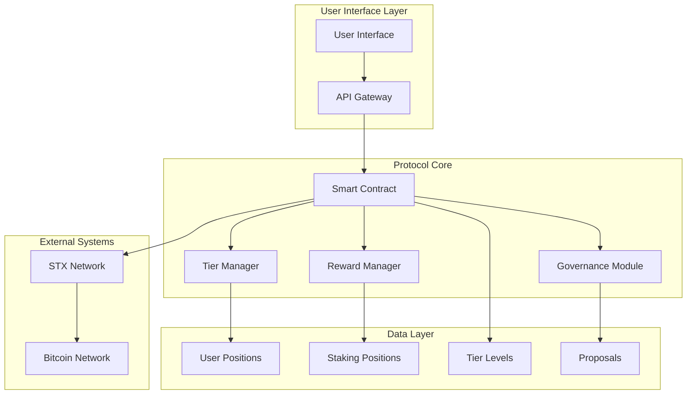

# BitVault Pro - Institutional-Grade Bitcoin L2 Staking Infrastructure


## 🔗 Table of Contents

- [Overview](#overview)
- [Architecture](#architecture)
- [Features](#features)
- [Tier System](#tier-system)
- [Installation](#installation)
- [Usage](#usage)
- [API Reference](#api-reference)
- [Testing](#testing)
- [Security](#security)
- [Contributing](#contributing)
- [License](#license)

## 🌟 Overview

BitVault Pro represents the next evolution in Bitcoin-secured DeFi infrastructure, architected specifically for the Stacks blockchain ecosystem. This revolutionary liquid staking protocol delivers institutional-grade yield optimization through intelligent tier mechanics and decentralized governance frameworks.

### Key Innovations

- **🏆 Multi-Tier Staking System**: Dynamic reward scaling from 5% base APY up to 10% for premium participants
- **🔒 Time-Lock Optimization**: Enhanced rewards for commitment-based staking (30-day, 60-day locks)
- **🗳️ Decentralized Governance**: Community-driven parameter optimization and treasury management
- **⚡ Bitcoin Security**: Full Bitcoin security inheritance through Stacks' Proof-of-Transfer consensus
- **💧 Liquid Staking**: Maintain liquidity while earning staking rewards

## 🏗️ Architecture



### Core Components

#### 1. **Staking Engine**

- Multi-tier reward calculation
- Time-lock commitment handling
- Automated compound interest
- Cooldown period management

#### 2. **Governance Framework**

- Proposal creation and voting
- Weighted voting power based on stake
- Community-driven parameter updates
- Treasury management

#### 3. **Security Layer**

- Emergency pause functionality
- Cooldown protection
- Multi-signature validation
- Audit-ready code structure

#### 4. **Data Management**

- User position tracking
- Staking position records
- Tier configuration matrix
- Governance proposal registry

## ✨ Features

### 🎯 Core Functionality

- **Stake STX Tokens**: Earn rewards on your STX holdings
- **Flexible Lock Periods**: Choose between flexible, 30-day, or 60-day commitments
- **Tier-Based Rewards**: Access higher rewards as your stake increases
- **Governance Participation**: Vote on protocol improvements and earn additional rewards
- **Emergency Controls**: Built-in safety mechanisms for protocol security

### 🚀 Advanced Features

- **Compound Rewards**: Automatic reward compounding for optimal yield
- **Multi-Tier System**: Bronze, Silver, and Gold tiers with increasing benefits
- **Governance Tokens**: Analytics tokens for enhanced protocol participation
- **Health Factor Monitoring**: Portfolio health tracking and risk management
- **Cooldown Protection**: Secure withdrawal process with time delays

## 🏅 Tier System

| Tier | Minimum Stake | Reward Multiplier | APY Range | Features |
|------|---------------|-------------------|-----------|----------|
| 🥉 **Bronze** | 1M uSTX | 1.0x | 5.0% - 7.5% | Basic staking, voting rights |
| 🥈 **Silver** | 5M uSTX | 1.5x | 7.5% - 11.25% | Enhanced rewards, governance access |
| 🥇 **Gold** | 10M uSTX | 2.0x | 10.0% - 15.0% | Premium rewards, full feature access |

### Time-Lock Multipliers

- **Flexible**: 1.0x multiplier (no lock)
- **30-Day Lock**: 1.25x multiplier
- **60-Day Lock**: 1.5x multiplier

## 🛠️ Installation

### Prerequisites

- Node.js 18+
- Clarinet CLI
- Stacks CLI (optional)

### Setup

1. **Clone the repository**

```bash
git clone https://github.com/hammedibr/bitvault.git
cd bitvault
```

2. **Install dependencies**

```bash
npm install
```

3. **Initialize Clarinet project**

```bash
clarinet integrate
```

4. **Run tests**

```bash
npm test
```

## 🚀 Usage

### Basic Staking

```clarity
;; Stake 5M uSTX with 30-day lock
(contract-call? .bitvault stake-stx u5000000 u4320)
```

### Governance Participation

```clarity
;; Create a governance proposal
(contract-call? .bitvault create-proposal 
  u"Increase base reward rate to 6%" 
  u2880)

;; Vote on proposal #1
(contract-call? .bitvault vote-on-proposal u1 true)
```

### Withdrawal Process

```clarity
;; Initiate unstaking
(contract-call? .bitvault initiate-unstake u1000000)

;; Complete withdrawal after cooldown
(contract-call? .bitvault complete-unstake)
```

## 📖 API Reference

### Public Functions

#### `initialize-contract()`

Initializes the protocol with default tier configurations.

**Returns**: `(response bool uint)`

#### `stake-stx(amount: uint, lock-period: uint)`

Stakes STX tokens with optional time-lock commitment.

**Parameters**:

- `amount`: Amount of uSTX to stake (minimum: 1M uSTX)
- `lock-period`: Lock duration (0, 4320, or 8640 blocks)

**Returns**: `(response bool uint)`

#### `initiate-unstake(amount: uint)`

Initiates the withdrawal process with security cooldown.

**Parameters**:

- `amount`: Amount of uSTX to unstake

**Returns**: `(response bool uint)`

#### `complete-unstake()`

Completes the withdrawal after cooldown period.

**Returns**: `(response bool uint)`

#### `create-proposal(description: string-utf8, voting-period: uint)`

Creates a new governance proposal.

**Parameters**:

- `description`: Proposal description (10-256 characters)
- `voting-period`: Voting duration (100-2880 blocks)

**Returns**: `(response uint uint)`

#### `vote-on-proposal(proposal-id: uint, vote-for: bool)`

Participates in governance voting.

**Parameters**:

- `proposal-id`: ID of the proposal to vote on
- `vote-for`: Vote direction (true for yes, false for no)

**Returns**: `(response bool uint)`

### Read-Only Functions

#### `get-contract-owner()`

Returns the contract owner address.

#### `get-stx-pool()`

Returns the total STX in the protocol pool.

#### `get-proposal-count()`

Returns the total number of governance proposals.

## 🧪 Testing

### Run Test Suite

```bash
# Run all tests
npm test

# Run tests with coverage
npm run test:report

# Watch mode for development
npm run test:watch
```

### Test Coverage

- Unit tests for all public functions
- Integration tests for staking workflows
- Governance mechanism testing
- Security and edge case validation

### Sample Test

```typescript
import { describe, expect, it } from "vitest";

describe("BitVault Staking Tests", () => {
  it("should stake STX successfully", () => {
    const { result } = simnet.callPublicFn(
      "bitvault", 
      "stake-stx", 
      [Cl.uint(1000000), Cl.uint(0)], 
      address1
    );
    expect(result).toBeOk(Cl.bool(true));
  });
});
```

## 🔒 Security

### Security Features

- **Cooldown Periods**: 24-hour withdrawal delays
- **Emergency Pause**: Protocol-wide emergency stops
- **Input Validation**: Comprehensive parameter checking
- **Access Controls**: Owner-only administrative functions
- **Overflow Protection**: Safe mathematical operations

### Audit Status

- [ ] Internal security review
- [ ] External security audit
- [ ] Bug bounty program
- [ ] Formal verification

### Known Considerations

- Smart contract upgrades require careful migration
- Governance attacks possible with large stake concentration
- MEV opportunities exist in unstaking timing

## 🤝 Contributing

We welcome contributions! Please see our [Contributing Guide](CONTRIBUTING.md) for details.

### Development Process

1. Fork the repository
2. Create a feature branch
3. Write tests for new functionality
4. Ensure all tests pass
5. Submit a pull request

### Code Style

- Follow Clarity best practices
- Use meaningful variable names
- Add comprehensive comments
- Maintain consistent formatting

## 📋 Roadmap

### Phase 1 (Current)

- [x] Core staking functionality
- [x] Multi-tier reward system
- [x] Basic governance framework
- [ ] Comprehensive testing suite

### Phase 2 (Q3 2025)

- [ ] Liquid staking tokens (stSTX)
- [ ] Advanced governance features
- [ ] Protocol yield optimization
- [ ] Cross-chain integrations

### Phase 3 (Q4 2025)

- [ ] Institutional features
- [ ] Advanced portfolio management
- [ ] Automated strategy execution
- [ ] Enterprise-grade APIs

## 📄 License

This project is licensed under the ISC License - see the [LICENSE](LICENSE) file for details.
